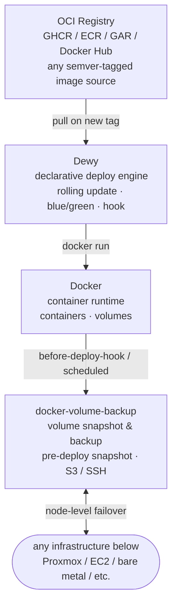

# Three-D Stack (3DS)

> The definitive **Docker · Dewy · DVB** stack for any infrastructure.

3DS is a portable, infrastructure-agnostic container platform that runs inside any Linux VM.
No Kubernetes. No vendor lock-in. Just three well-chosen tools working together.

---

## What is 3DS?

3DS wires together three open-source tools into a cohesive deployment platform:

| Component | Role |
|---|---|
| **[Dewy](https://github.com/linyows/dewy)** | Pull-based declarative deploy engine |
| **[Docker](https://www.docker.com/)** | Container runtime & volume management |
| **[docker-volume-backup (DVB)](https://github.com/offen/docker-volume-backup)** | Container volume backup & restore |

The stack deliberately lives _inside_ the VM layer. Proxmox HA, AWS Auto Scaling, or any other infrastructure-level resilience mechanism sits below and handles node-level concerns independently. 3DS owns everything from the container runtime upward.



---

## Features

### Dewy — declarative deploy engine

- **Pull-based reconciliation** — Dewy continuously polls your OCI registry and deploys the latest semver-tagged image automatically. No push webhooks needed.
- **Zero-downtime rolling updates** — new container starts, passes a health check, then traffic shifts via Docker network alias before the old container drains and stops.
- **Blue/Green deployment** — control deployment slots using semver build metadata (`v1.2.0+blue`, `v1.2.0+green`) and the `--slot` flag. Flip traffic between slots without touching the running workload.
- **Replica management** — `--replicas N` runs multiple instances of a container on a single node.
- **Health checks** — `--health-path /health` gates traffic cutover on an HTTP 200 response.
- **Deploy hooks** — `--before-deploy-hook` and `--after-deploy-hook` execute shell scripts at defined lifecycle points. A failing before-hook aborts the deploy automatically.
- **Built-in notifications** — Slack and SMTP support out of the box. Error notifications are rate-limited to prevent alert fatigue.
- **Audit log** — every successful deploy is recorded back to the registry.

### Docker — container runtime

- Named volumes persist data across container updates managed by Dewy.
- Docker network aliases enable instantaneous traffic cutover between old and new containers.
- All standard `docker run` options (`-e`, `-v`, `--cpus`, `--memory`, etc.) pass through Dewy's `--` separator.

### docker-volume-backup — volume protection

- **Pre-deploy snapshots** — triggered by Dewy's `before-deploy-hook` to capture a point-in-time archive of volumes before any change lands.
- **Scheduled backups** — runs as a companion container on a cron schedule defined via environment variable.
- **Multiple backends** — local directory, S3-compatible storage, WebDAV, Azure Blob, Dropbox, Google Drive, or SSH.
- **GPG encryption** — optional at-rest encryption for sensitive volumes.
- **Retention management** — automatic rotation of old archives.
- **Selective container stop** — attach `docker-volume-backup.stop-during-backup=true` to containers that require consistency (e.g. databases). All other containers continue running.

> **Note on databases:** PostgreSQL, MySQL, and similar engines write data across multiple files. Copying a live data directory can produce an inconsistent snapshot. Use `stop-during-backup=true` for database containers, or add a `pg_dump` / `mysqldump` call inside `before-deploy.sh` and back up the dump file instead.

---

## Getting Started

### Prerequisites

- A Linux VM with Docker installed
- An OCI-compatible container registry (GHCR, ECR, GAR, Docker Hub, or self-hosted)
- Dewy binary ([releases](https://github.com/linyows/dewy/releases))

> **Using Ansible?** See [ansible/](ansible/) to provision a VM and deploy apps in one command.

### 1. Create your app directory

Copy the sample template and rename it for your application:

```bash
cp -r apps/sample-app apps/my-app
cd apps/my-app
cp dewy.env.example dewy.env
```

### 2. Configure `dewy.env`

Edit `dewy.env` with your registry URL, port, and any extra `docker run` arguments:

```bash
# apps/my-app/dewy.env
DEWY_REGISTRY=img://ghcr.io/your-org/your-app
DEWY_PORT=8080
DEWY_HEALTH_PATH=/health
DEWY_REPLICAS=2
DEWY_BEFORE_DEPLOY_HOOK=./hooks/before-deploy.sh
DEWY_AFTER_DEPLOY_HOOK=./hooks/after-deploy.sh
DEWY_NOTIFIER=slack://your-channel?title=your-app
DEWY_EXTRA_ARGS="-v app-data:/data --memory 512m"
```

> `dewy.env` is gitignored. `dewy.env.example` is the committed template.

### 3. Start peripheral services

Launch the database and DVB backup daemon with Docker Compose:

```bash
docker compose up -d
```

### 4. Start Dewy

```bash
export GITHUB_TOKEN=ghp_xxxxxxxxxxxx   # or registry credentials

dewy container \
  --registry "${DEWY_REGISTRY}" \
  --port "${DEWY_PORT}" \
  --health-path "${DEWY_HEALTH_PATH}" \
  --replicas "${DEWY_REPLICAS}" \
  --before-deploy-hook "${DEWY_BEFORE_DEPLOY_HOOK}" \
  --after-deploy-hook  "${DEWY_AFTER_DEPLOY_HOOK}" \
  --notifier "${DEWY_NOTIFIER}" \
  -- ${DEWY_EXTRA_ARGS}
```

> In production, Dewy runs as a systemd service. The Ansible `dewy_setup` role handles this automatically.

---

## Blue/Green Deployment

Tag your releases with build metadata to target a specific deployment slot:

```bash
# Deploy v1.2.0 to the green slot only
gh release create v1.2.0+green

# Start Dewy with --slot to filter by slot
dewy container --registry img://ghcr.io/your-org/app --slot green ...
dewy container --registry img://ghcr.io/your-org/app --slot blue  ...
```

Workflow:

1. Both slots run the current stable version (`v1.1.0+blue`, `v1.1.0+green`).
2. Release `v1.2.0+green` — only the green Dewy instance updates.
3. Validate green. Switch load balancer traffic to green.
4. Release `v1.2.0+blue` — blue catches up. Both slots now run `v1.2.0`.

---

## Repository Layout

```
three-d-stack/
├── apps/                          # One directory per application
│   └── sample-app/
│       ├── dewy.env.example       # Dewy config template (copy → dewy.env)
│       ├── hooks/
│       │   ├── before-deploy.sh   # Pre-deploy DVB snapshot
│       │   └── after-deploy.sh    # Post-deploy migration / notification
│       └── compose.yaml           # Peripheral services (DB, DVB, etc.)
├── core/
│   └── global-hooks/
│       ├── backup.sh              # Reusable DVB snapshot helper
│       └── notify.sh              # Reusable Slack notification helper
├── ansible/
│   ├── inventories/               # Local (OrbStack) and Proxmox VE targets
│   ├── playbooks/                 # setup-node.yml, deploy-app.yml
│   └── roles/
│       ├── 3ds_base/              # Docker install & network setup
│       └── dewy_setup/            # Dewy binary + systemd service per app
├── docs/
│   ├── getting-started.md
│   ├── blue-green.md
│   ├── backup-restore.md
│   └── infrastructure-notes.md   # Proxmox / OrbStack setup notes
└── README.md
```

**Role separation:**

| Component | Managed by |
|---|---|
| Application container lifecycle | **Dewy** (`docker run`, rolling update, replicas) |
| Peripheral services (DB, Redis, DVB) | **Docker Compose** (static, long-running) |

---

## Scope

3DS is intentionally scoped to the **VM-internal layer**.

| Concern | Owner |
|---|---|
| Container deploy lifecycle | Dewy |
| Container runtime & volumes | Docker |
| Volume backup & pre-deploy snapshots | docker-volume-backup |
| Node-level failover | Your infrastructure (Proxmox HA, ASG, etc.) |
| VM-level backup & snapshots | Your infrastructure (PBS, AWS Snapshots, etc.) |
| Service discovery / load balancing | Your infrastructure (Nginx, Traefik, etc.) |

This boundary means 3DS runs identically on Proxmox VE, AWS EC2, a Hetzner VPS, or a bare-metal server. Infrastructure-specific setup lives in `docs/infrastructure-notes.md` and is never a dependency of the core stack.

---

## Limitations

- **Single-node replica management only** — Dewy's `--replicas` runs multiple containers on one VM. Cross-node scheduling requires infrastructure-level orchestration (Proxmox HA, Kubernetes, Nomad).
- **No built-in service discovery** — use Nginx, Traefik, or a similar reverse proxy in front of the stack.
- **No secrets management** — inject secrets via environment variables or mount from a secrets manager (HashiCorp Vault, AWS SSM, etc.).
- **Database backup consistency** — live volume copy is not crash-consistent for most databases. Use `stop-during-backup=true` or database-native dump hooks.

---

## License

MIT

---

## Acknowledgements

3DS stands on the shoulders of three excellent open-source projects:

- [linyows/dewy](https://github.com/linyows/dewy) — declarative deployment for non-Kubernetes environments
- [Docker](https://www.docker.com/) — the container runtime the world runs on
- [offen/docker-volume-backup](https://github.com/offen/docker-volume-backup) — simple, reliable Docker volume backups
