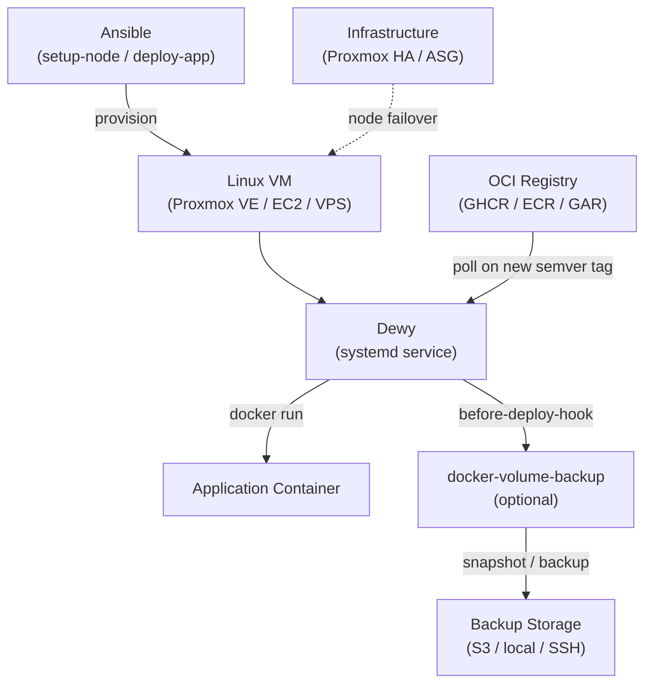

# Architecture Decisions — Three-D Stack (3DS)

_Last updated: 2026-04-12_

---

## Directory Structure

```
three-d-stack/
├── apps/
│   └── sample-app/
│       ├── dewy.env.example
│       └── backup/                    # optional — only for apps that need DVB
│           ├── hooks/
│           │   ├── before-deploy.sh
│           │   └── after-deploy.sh
│           └── compose.yaml
├── core/
│   └── global-hooks/
│       ├── backup.sh
│       └── notify.sh
├── ansible/
│   ├── inventories/
│   │   ├── local/                     # OrbStack
│   │   └── proxmox/                   # Proxmox VE
│   ├── playbooks/
│   │   ├── setup-node.yml
│   │   └── deploy-app.yml
│   └── roles/
│       ├── 3ds_base/
│       └── dewy_setup/
└── docs/
```

---

## Ansible Role Design

### `3ds_base`

- Install Docker via official apt repository (Debian/Ubuntu)
- Skip Docker install if already present (`docker --version` check)
- Create shared Docker network (`3ds-net`)
- Provision `/opt/3ds/apps/` on the target VM

### `dewy_setup`

- Download Dewy binary from GitHub Releases (version-pinned, arch auto-detected)
- Copy app files from control node to VM using `apps_dir` variable
- Auto-copy all `*.env` files (except `dewy.env`) as extra env files for the container
- Copy `backup/` subdirectory (hooks, compose.yaml) only if it exists
- Generate `dewy-start.sh` wrapper script (handles word-splitting of `DEWY_EXTRA_ARGS`)
- Generate systemd unit file per app (`dewy-<app>.service`)
- Enable and start service only if `dewy.env` exists on control node

**`apps_dir` variable (kubespray-style):**

```yaml
# default: two levels above playbook dir (= repo root)/apps
apps_dir: "{{ playbook_dir | dirname | dirname }}/apps"
```

Override to point at a separate infra repo:
```bash
ansible-playbook ... -e "apps_dir=/path/to/infra/apps"
```

**`dewy-start.sh` — why a wrapper script:**

systemd `ExecStart=` does not word-split variable expansions. `DEWY_EXTRA_ARGS="--memory 512m --cpus 1"` passed directly to `ExecStart=` becomes a single argument. The wrapper shell script delegates splitting to `sh`, and also dynamically collects `--env-file` arguments from all `*.env` files in the app directory.

**systemd unit template:**

```ini
[Unit]
Description=Dewy container manager for {{ app_name }}
After=docker.service
Requires=docker.service

[Service]
EnvironmentFile={{ three_ds_apps_dir }}/{{ app_name }}/dewy.env
WorkingDirectory={{ three_ds_apps_dir }}/{{ app_name }}
ExecStart={{ three_ds_apps_dir }}/{{ app_name }}/dewy-start.sh
Restart=on-failure

[Install]
WantedBy=multi-user.target
```

---

## `backup/` subdirectory pattern

Apps that need DVB backup place all backup-related files under `backup/`:

```
my-app/
├── dewy.env
└── backup/
    ├── hooks/
    │   ├── before-deploy.sh   # triggers DVB snapshot via docker run
    │   └── after-deploy.sh
    └── compose.yaml           # DB + DVB scheduled daemon
```

Apps without backup (bots, workers) need only `dewy.env` and any extra `*.env` files. The Ansible role detects `backup/` presence with `stat` and skips backup-related copy tasks when absent.

---

## System Diagram



---

## Trade-offs

| Decision | Trade-off |
|----------|-----------|
| Dewy over Compose for app lifecycle | Dewy is a smaller community project — if unmaintained, core deploy mechanism needs replacement |
| Single-node replicas | Cross-node HA requires infrastructure layer |
| Ansible for distribution | Requires Ansible on operator's machine |
| No built-in secrets management | Users must wire in Vault / SSM / etc. |
| `backup/` optional subdirectory | Cleaner separation but operators must know the pattern |
