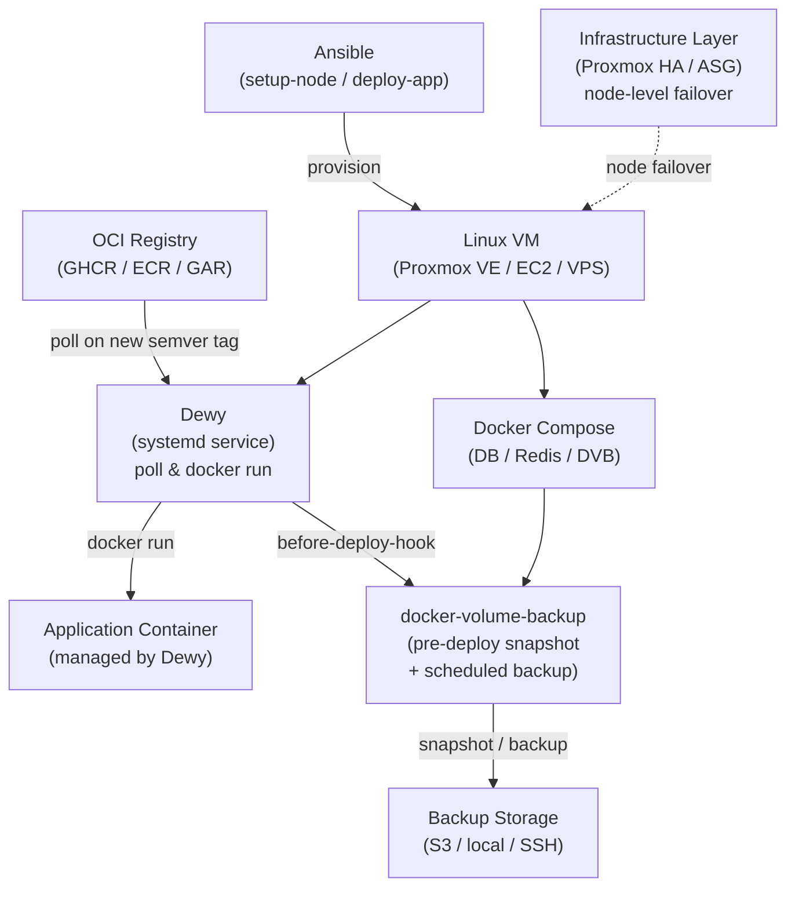

# Architecture Decisions — Three-D Stack (3DS)

_Date: 2026-04-08_

---

## Repository Structure

```
three-d-stack/
├── apps/                          # Per-application directories
│   └── sample-app/
│       ├── dewy.env.example       # Dewy config template (committed; copy to dewy.env to use)
│       └── backup/                # Optional: DVB backup sub-tree (omit if no backup needed)
│           ├── hooks/
│           │   ├── before-deploy.sh   # Trigger DVB snapshot before deploy
│           │   └── after-deploy.sh    # Post-deploy notification
│           └── compose.yaml           # Peripheral services (DB, DVB, etc.)
├── core/
│   └── global-hooks/
│       ├── backup.sh              # Reusable DVB backup logic
│       └── notify.sh              # Reusable notification logic
├── ansible/
│   ├── inventories/
│   │   ├── local/                 # OrbStack / VirtualBox test VMs
│   │   └── proxmox/               # Proxmox VE production
│   ├── playbooks/
│   │   ├── setup-node.yml         # Bootstrap a VM for 3DS
│   │   └── deploy-app.yml         # Deploy / update an application
│   └── roles/
│       ├── 3ds_base/              # Docker install, network setup, directory layout
│       └── dewy_setup/            # Dewy binary, systemd service per app
├── .devcontainer/
│   └── devcontainer.json          # Contributor development environment
├── docs/
├── .github/
│   ├── ISSUE_TEMPLATE/
│   └── workflows/
│       └── lint.yml               # yamllint / shellcheck / ansible-lint (planned: v0.3.0)
└── README.md
```

---

## Dewy App Configuration Pattern (`dewy.env.example` / `dewy.env`)

Each app ships a committed `apps/<app>/dewy.env.example` template.
Operators copy it to `dewy.env` (gitignored) and fill in real values.
The Ansible `dewy_setup` role transfers `dewy.env` to the VM and loads it via systemd `EnvironmentFile=`.

```bash
# apps/sample-app/dewy.env.example
DEWY_REGISTRY=img://ghcr.io/your-org/sample-app
DEWY_PORT=8080
DEWY_HEALTH_PATH=/health
DEWY_REPLICAS=2
DEWY_BEFORE_DEPLOY_HOOK=./backup/hooks/before-deploy.sh
DEWY_AFTER_DEPLOY_HOOK=./backup/hooks/after-deploy.sh
DEWY_NOTIFIER=slack://your-channel?title=sample-app

# Extra args passed to docker run (after Dewy's -- separator)
DEWY_EXTRA_ARGS="-v app-data:/data --memory 512m"
```

---

## Ansible Role Design

### `3ds_base`

Responsibilities:
- Install Docker via official apt/yum repository
- Configure Docker daemon
- Create shared Docker network (`3ds-net`)
- Provision `/opt/3ds/apps/<app>/` directory structure on target VM

### `dewy_setup`

Responsibilities:
- Download Dewy binary from GitHub Releases (version-pinned)
- Deploy app files from repository to `/opt/3ds/apps/<app>/`
- Generate systemd unit file from template (one unit per app)
- Enable and start the service

**systemd unit template:**

```ini
[Unit]
Description=Dewy container manager for {{ app_name }}
After=docker.service
Requires=docker.service

[Service]
EnvironmentFile=/opt/3ds/apps/{{ app_name }}/dewy.env
WorkingDirectory=/opt/3ds/apps/{{ app_name }}
ExecStart=/usr/local/bin/dewy container \
  --registry ${DEWY_REGISTRY} \
  --port ${DEWY_PORT} \
  --health-path ${DEWY_HEALTH_PATH} \
  --replicas ${DEWY_REPLICAS} \
  --before-deploy-hook ${DEWY_BEFORE_DEPLOY_HOOK} \
  --after-deploy-hook ${DEWY_AFTER_DEPLOY_HOOK} \
  -- ${DEWY_EXTRA_ARGS}
Restart=on-failure

[Install]
WantedBy=multi-user.target
```

---

## DevContainer Toolchain (Contributor Environment)

| Tool | Purpose |
|------|---------|
| `ansible-core` + `ansible-lint` | Playbook / Role development and static analysis |
| `yamllint` | YAML file validation |
| `shellcheck` | Hook script static analysis |
| `docker-cli` | Local smoke testing (daemon runs on host) |
| `molecule` | Ansible Role unit testing (Docker driver) |

---

## CI Pipeline (GitHub Actions)

```
push / PR
  └── lint.yml
        ├── shellcheck: apps/**/hooks/*.sh core/global-hooks/*.sh
        ├── yamllint:   apps/**/compose.yaml ansible/**/*.yml
        └── ansible-lint: ansible/
```

Future addition: Molecule-based Role integration tests.

---

## Development Process

Lightweight GitHub Flow for solo OSS:

| Branch | Purpose |
|--------|---------|
| `main` | Always releasable |
| `dev` | Integration branch |
| `feat/*` | Feature branches (per GitHub Issue) |

---

## System Architecture Diagram



---

## Trade-offs & Risks

| Decision | Trade-off |
|----------|-----------|
| Dewy over docker-compose for app lifecycle | Dewy is a smaller community project; if it becomes unmaintained, the core deploy mechanism needs replacement |
| Single-node replica management | Dewy replicas run on one VM; cross-node HA requires infrastructure layer |
| Ansible for distribution | Requires Ansible on the operator's machine; lower barrier than custom CLI but higher than a single shell script |
| No built-in secrets management | Users must wire in Vault / SSM / etc. themselves |
